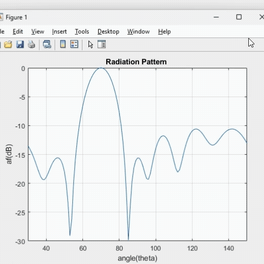
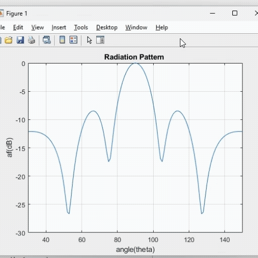
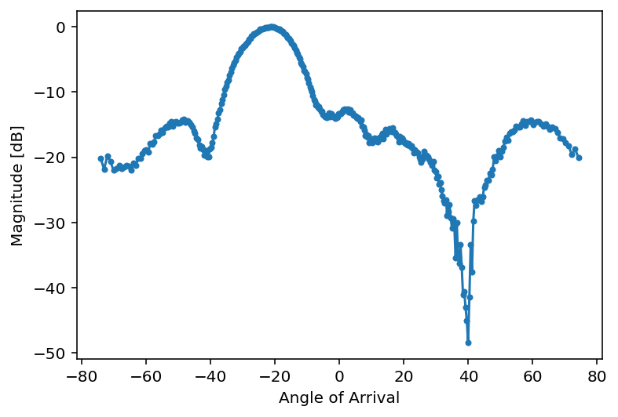
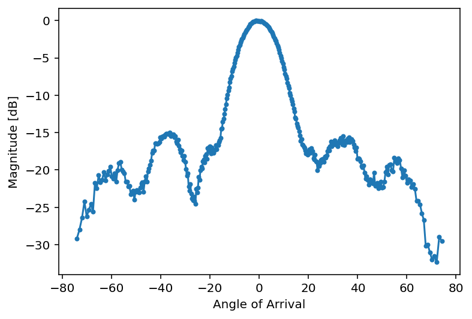

# Side Lobe Level (SLL) Optimization using Genetic Algorithm

From satellite communications and electronic warfare to wireless networks and radar sensors, phase arrays are also finding their way into systems. They are faster, more accurate, and more reliable because they steer the beam electronically. Yet, one of the old and technically challenging obstacle in the design of the phased arrays is the SLLs control. These unwanted lobes radiate energy into planes other than those in which the main lobe is directed, giving rise to interference that may degrade performance.
Traditional sidelobe suppression approaches, such as Chebyshev tapering, Dolph–Chebyshev windows, or Taylor distributions, are based on amplitude weighting applied across array elements. They provide predictable radiation behavior and are based on well-established theory, but they are usually not very versatile. Here the optimum working conditions are considered, such as the uniform distance, the weak coupling and the excitation.
To mitigate these drawbacks, the researchers have taken recourse to optimization techniques such as Genetic Algorithms (GAs). They can also mimic evolution in order to explore large, complex solution spaces. The ability to precisely control the phase of light emitted from individual array elements allows for dynamic beam shaping and steering, offering significant advantages in terms of speed, precision, and flexibility. GAs have proved to be highly potential in antenna design because it can solve the nonlinear, multi-variable problem without any need of closed form solution or gradients. A genetic algorithm is employed to optimize the element positions in the sparse array while maintaining the aperture size and achieving a low sidelobe level and high gain performance.

# Practical Set-Up
The practical implementation was carried out using the Analog Devices CN0566 Phaser kit, configured as an 8-element linear phased array antenna system operating in the X-band frequency range. 

The CN0566 Phaser kit was configured as a receiver-only phased array antenna system and used as the receiver in the experiment. The transmitter was an HB100, a digital 10.525 GHz microwave motion detector sensor provided by DFRobot, operating as a continuous wave signal source. As shown, the HB100 was positioned at the mechanical boresight (0° azimuth) of the Phaser kit, at a distance of 5m in an open environment. RF System Specifications were as follows: It’s operating frequency range, fc was 10.0–10.5 GHz (X-band), Centre Frequency set to 10.25GHz and The-3 dB bandwidth of the antennas ranged from 9.9 to 10.8GHz, whereas Intermediate Frequency – fIF was 2.2GHz after down conversion.

# Simulation Results

# Practical results

