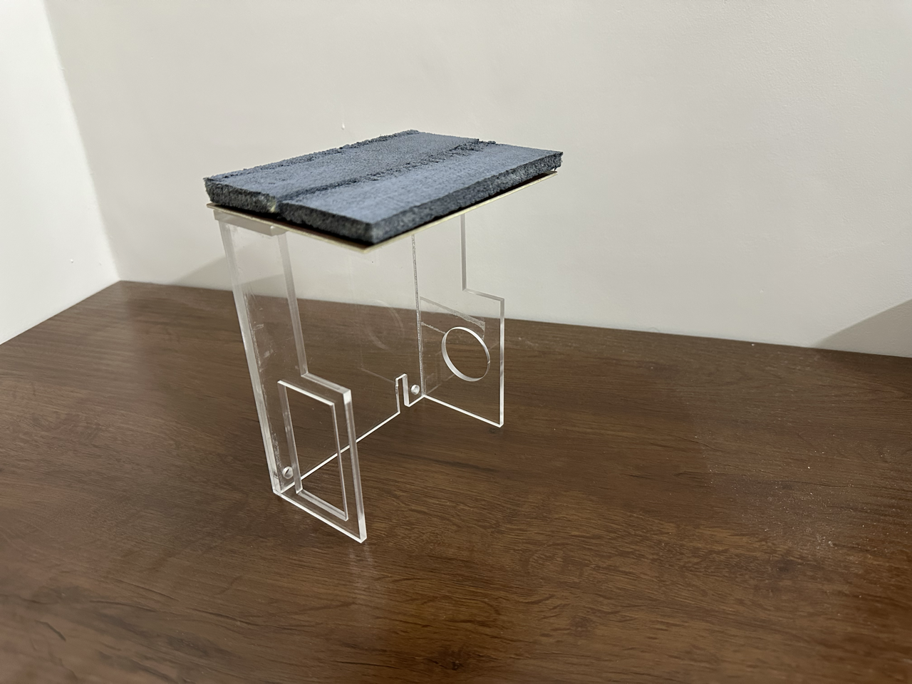
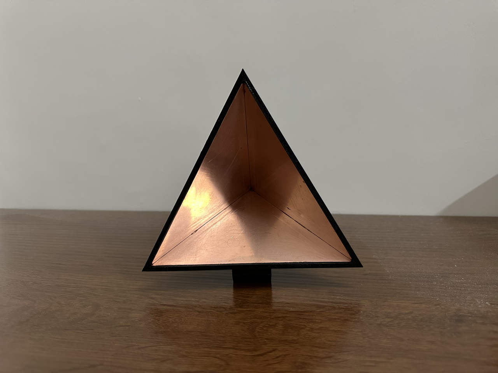
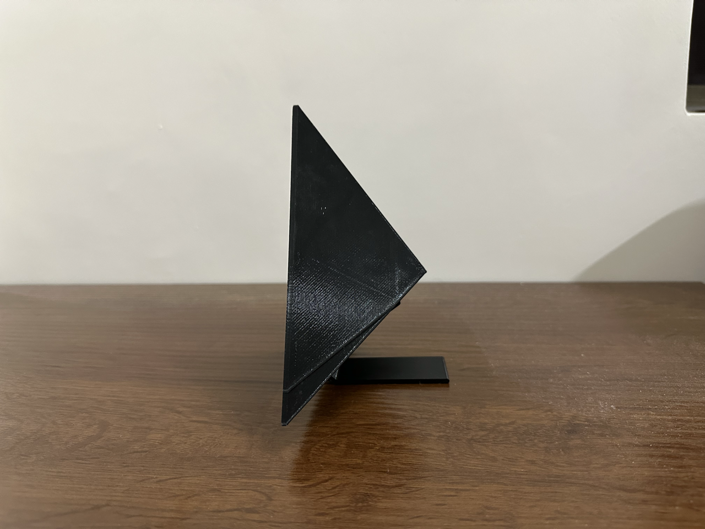
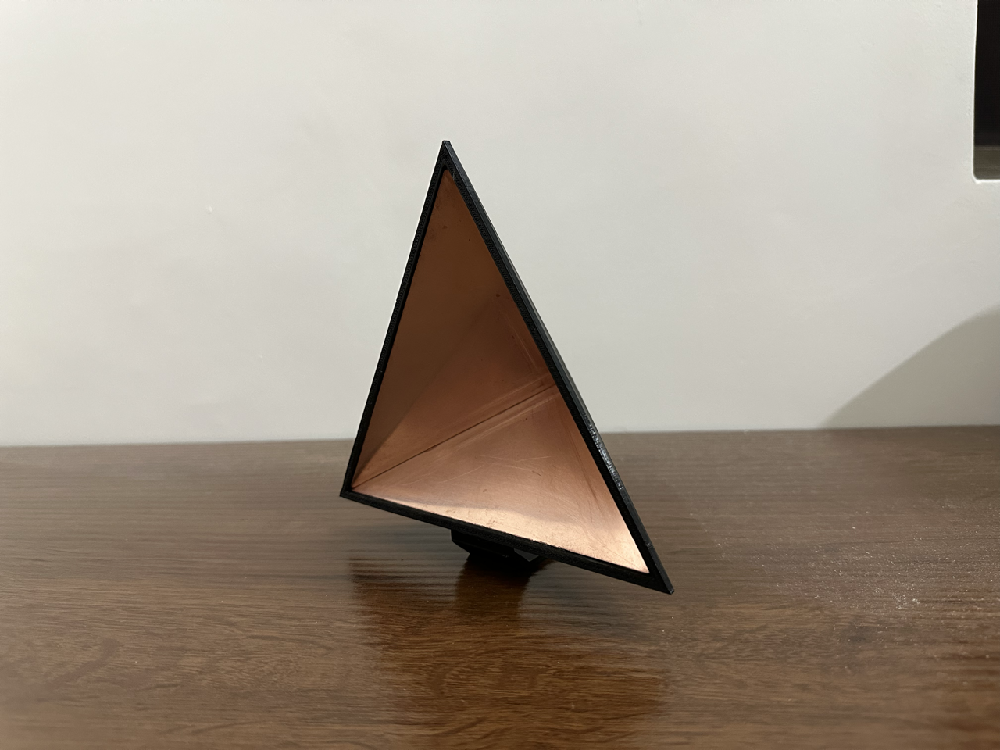
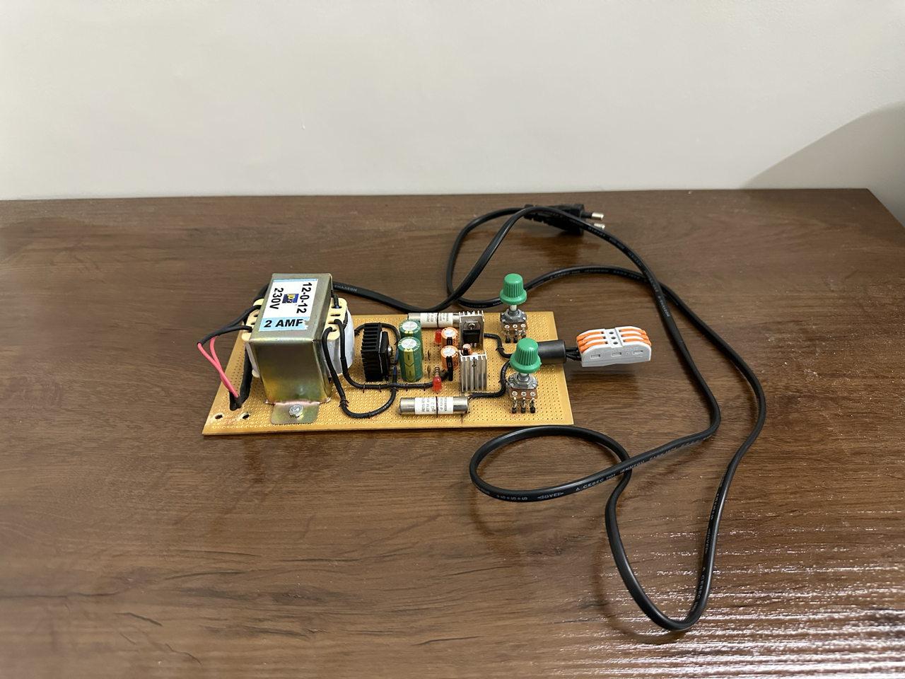
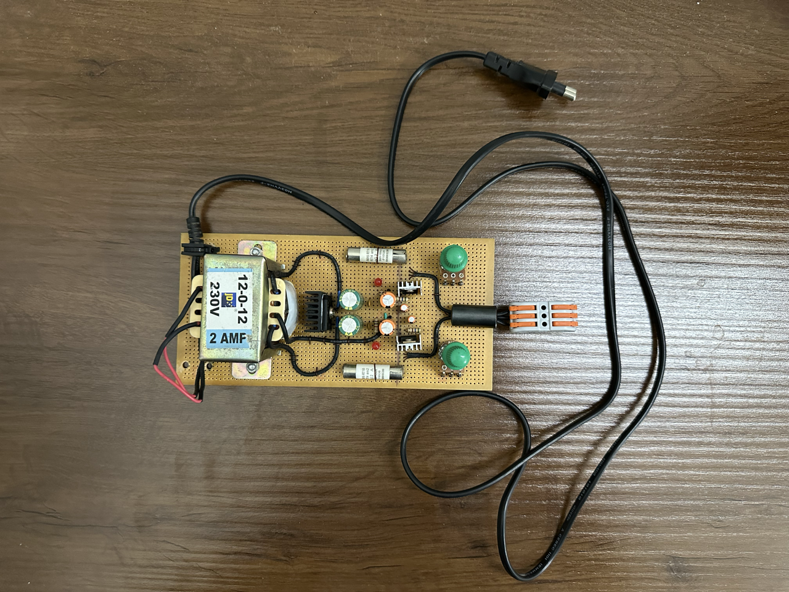

# Description
This folder holds all the supporting materials we have made for the main project. These include a sturdy protective case, Trihedral Corner Reflector, Home-made microwave absorbing foam, and a Dual-Rail Power Supply. 

## Protective Case with Absorbing Material on top

## Tri-hedral Corner Reflector

## Dual Rail Power Supply

